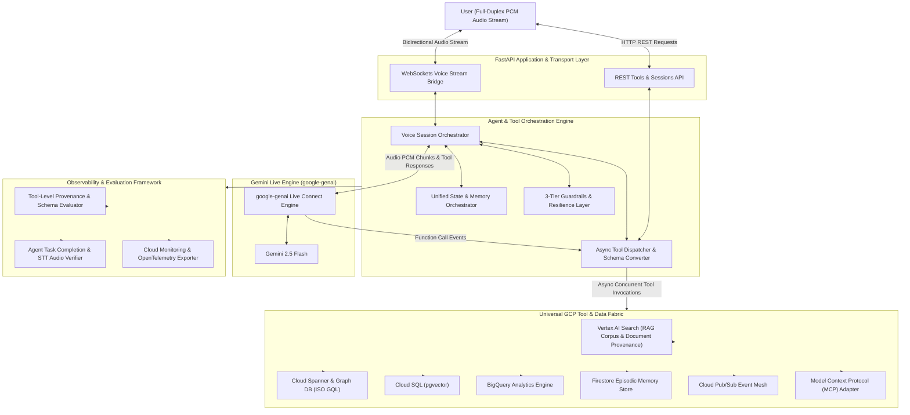

# Universal GCP Multimodal Voice AI Framework

Production-grade Voice AI Framework for Google Cloud Platform. The architecture connects client applications to Google Gemini Live (Multimodal Live WebSockets API) via the google-genai SDK for low-latency, full-duplex voice interactions.

## Architecture Flow



## System Capabilities

### Gemini Live Integration
* Uses the official `google-genai` SDK for bidirectional streaming over WebSockets.
* Supports dual authentication via Vertex AI (Application Default Credentials) and Google AI Studio (API Key).
* Configured by default for `gemini-2.5-flash` with native context window compression.

### Agent and Tool Orchestration
* **Voice Session Orchestrator**: Manages multi-turn session lifecycles, user identities, barge-in audio interruptions, and context window compaction.
* **Async Tool Dispatcher**: Dynamically converts Pydantic tool models into Gemini OpenAPI Function Declarations, intercepts live WebSocket function calls, executes concurrent GCP tool invocations, and returns formatted responses back to the Live stream.

### Resilience Engineering
* **Token-Bucket Rate Limiter**: Enforces configurable rate limits per user session to protect downstream GCP services.
* **Circuit Breakers**: Implements state-machine breakers (CLOSED, OPEN, HALF_OPEN) across all GCP connectors to isolate backend outages gracefully.
* **Exponential Backoff Retries**: Decorates API operations with backoff and full jitter to recover from transient network drops automatically.

### Multi-Service GCP Extraction
* Real-time connectors for Cloud Spanner, Spanner Graph DB (ISO GQL), Cloud SQL (`pgvector`), Firestore, BigQuery, Cloud Pub/Sub, and Vertex AI Search (RAG).
* Enables the voice agent to extract structured data across multiple GCP backend services in a single conversational turn and speak unified insights back to the user.

### State and Memory Management
* **Working Memory**: In-memory ring buffer tracking recent conversation turns with automated background context compaction.
* **Episodic Memory**: Persistent cross-session user profile and conversation state stored in Cloud Firestore.

### Tool-Level and Agent-Level Evaluations
* **Tool Execution Evaluator**: Verifies schema compliance, execution latency (ms), RAG Corpus ID and Document URI provenance metadata, and database row provenance.
* **Agent Performance Evaluator**: Measures end-to-end task success rates, turn latency percentiles (p50, p95, p99), response groundedness, and Word Error Rate (WER) using `google-cloud-speech` STT audio transcript verification.

### Security Guardrails
* Three-tier security engine enforcing input prompt injection detection, tool execution boundary protection (blocking unauthorized DDL/DML mutations), and output harm evaluation.

## Quick Start

1. Install Dependencies

```bash
git clone https://github.com/bhav09/gcp-voice-ai-framework.git
cd gcp-voice-ai-framework

python3 -m venv .venv
source .venv/bin/activate
pip install -r requirements.txt
```

2. Environment Configuration

Copy the sample configuration file and update parameters:

```bash
cp .env.example .env
```

Set environment variables in `.env`:

```bash
GCP_PROJECT_ID=YOUR_GCP_PROJECT_ID
GCP_REGION=us-central1
VOICE_PROVIDER_TYPE=vertex
GEMINI_MODEL_NAME=gemini-2.5-flash
GEMINI_VOICE_NAME=Puck
```

3. Run the Service

```bash
python -m uvicorn src.api.fastapi_app:app --host 0.0.0.0 --port 8000
```

Access API documentation at `http://localhost:8000/docs` or establish WebSocket connections at `ws://localhost:8000/ws/voice`.

4. Testing

Run the test suite:

```bash
python run_tests.py
```

## License

Universal framework template for Google Cloud Platform.
