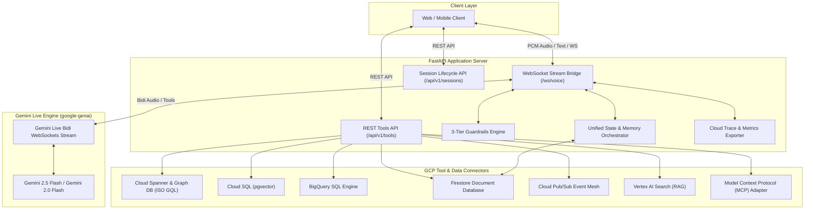

# Universal GCP Multimodal Voice AI Framework

Production-grade Voice AI Framework for Google Cloud Platform. The architecture connects client applications to Google Gemini Live (Multimodal Live WebSockets API) via the google-genai SDK for low-latency, full-duplex voice interactions.

## System Architecture



## Key Capabilities

Gemini Live Integration
Uses the google-genai SDK for bidirectional streaming over WebSockets. Supports authentication via Vertex AI (Application Default Credentials) and Google AI Studio (API Key). Configurable models default to gemini-2.5-flash with native context window compression.

FastAPI Application Layer
Exposes WebSocket voice streaming on /ws/voice, REST endpoints for tool execution on /api/v1/tools/execute, and session lifecycle management on /api/v1/sessions. Includes health check endpoints.

GCP Tool Integrations
Connectors for Cloud Spanner, Spanner Graph DB (ISO GQL), Cloud SQL (pgvector), Firestore, BigQuery, Cloud Pub/Sub, and Vertex AI Search (RAG). Supports external tool servers via Model Context Protocol (MCP).

State and Memory Management
Short-term working memory ring buffer with automatic context compaction, paired with persistent episodic memory stored in Cloud Firestore.

Voice Output STT Verification
Automated speech-to-text verification harness using google-cloud-speech to transcribe generated audio output and measure Word Error Rate (WER) against expected ground truth phrases.

Security Guardrails
Three-tier guardrail system covering input prompt injection checks, tool execution boundary filters (blocking DDL/DML mutations), and output safety evaluation.

## Quick Start

1. Install Dependencies

```bash
git clone https://github.com/bhav09/gcp-voice-ai-framework.git
cd gcp-voice-ai-framework

python3 -m venv .venv
source .venv/bin/activate
pip install -r requirements.txt
```

2. Environment Configuration

Copy the sample configuration file and update parameters:

```bash
cp .env.example .env
```

Set environment variables in .env:

```bash
GCP_PROJECT_ID=YOUR_GCP_PROJECT_ID
GCP_REGION=us-central1
VOICE_PROVIDER_TYPE=vertex
GEMINI_MODEL_NAME=gemini-2.5-flash
GEMINI_VOICE_NAME=Puck
```

3. Run the Service

```bash
python -m uvicorn src.api.fastapi_app:app --host 0.0.0.0 --port 8000
```

Access API documentation at http://localhost:8000/docs or establish WebSocket connections at ws://localhost:8000/ws/voice.

4. Testing

Run the test suite:

```bash
python run_tests.py
```

## License

Universal framework template for Google Cloud Platform.
